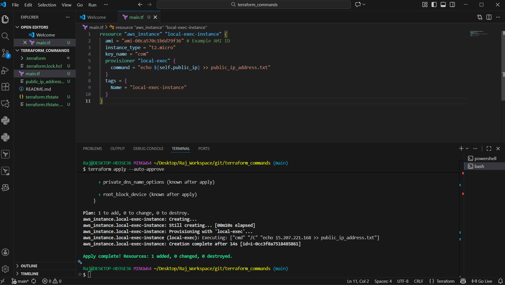
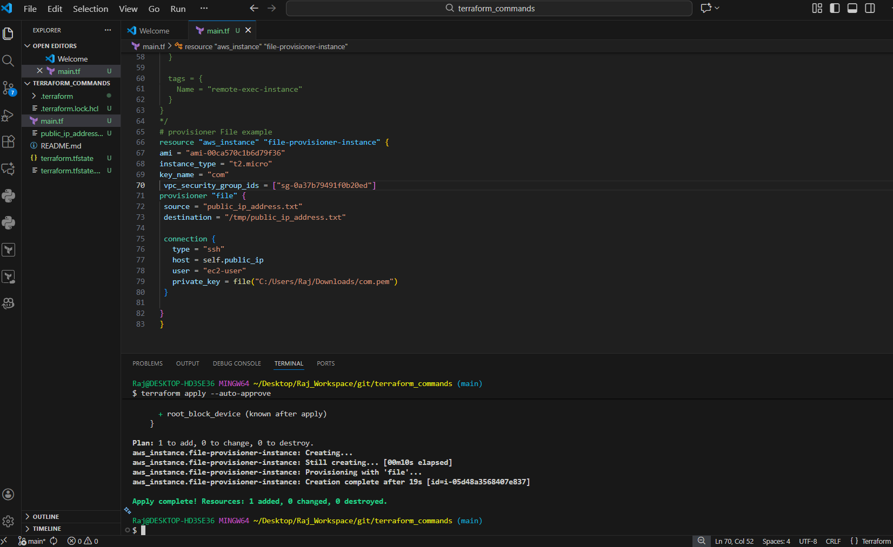
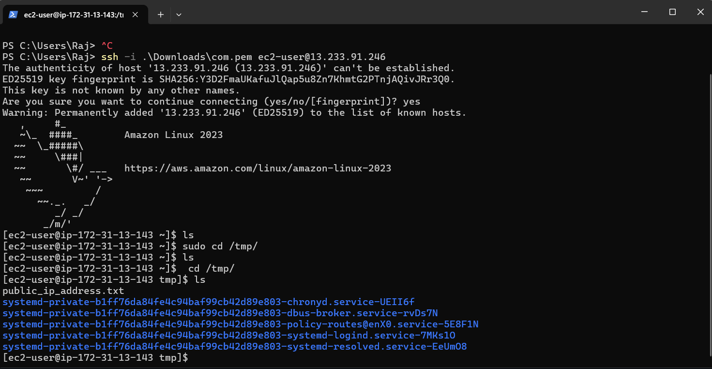
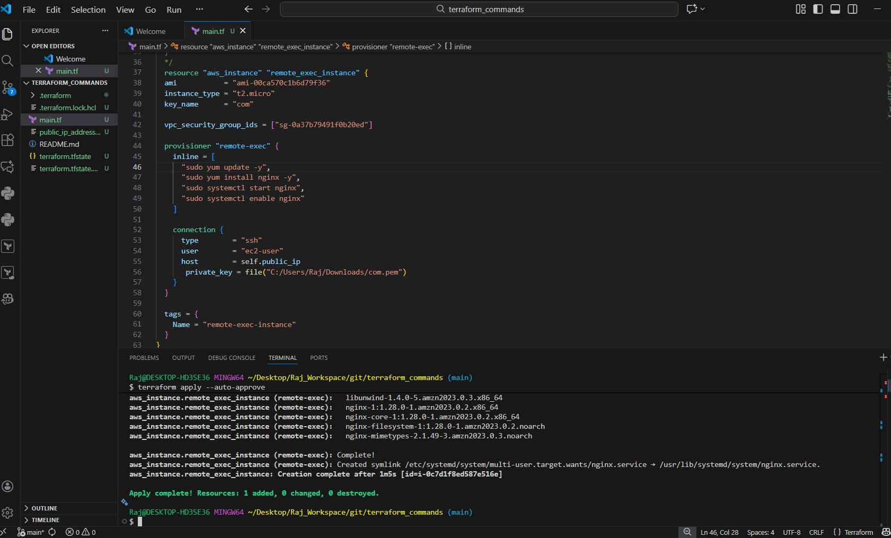
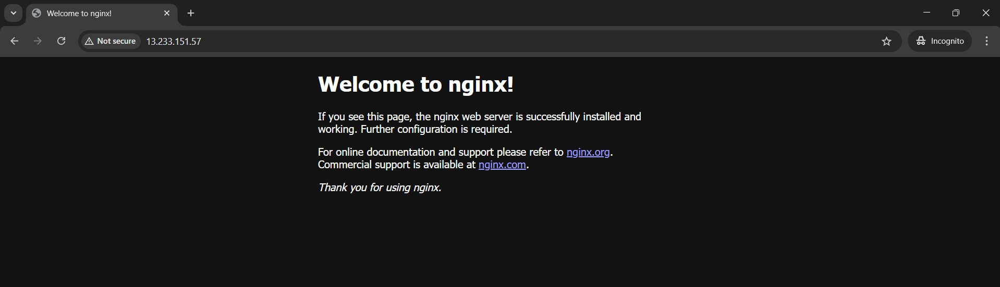
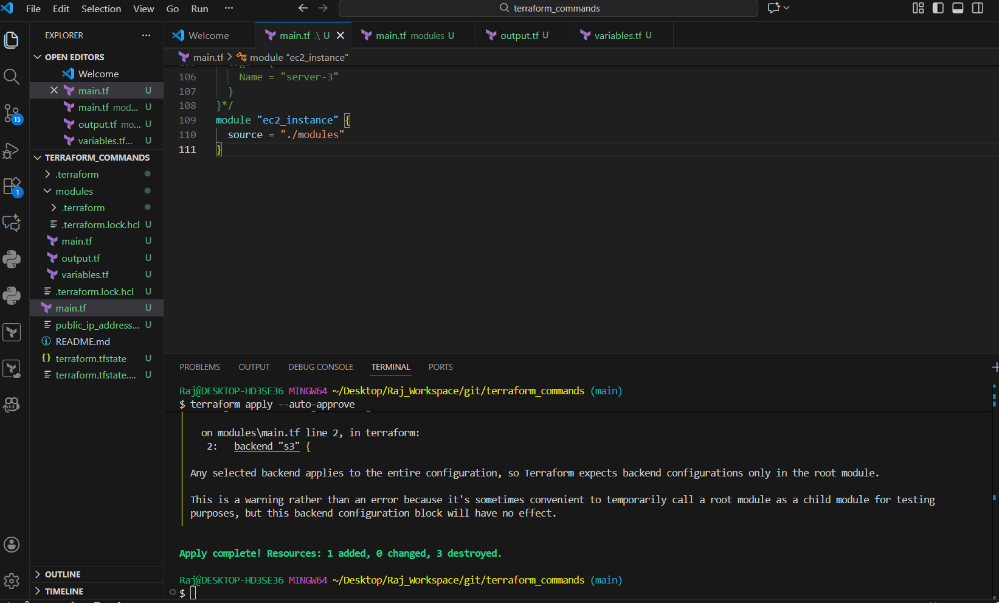
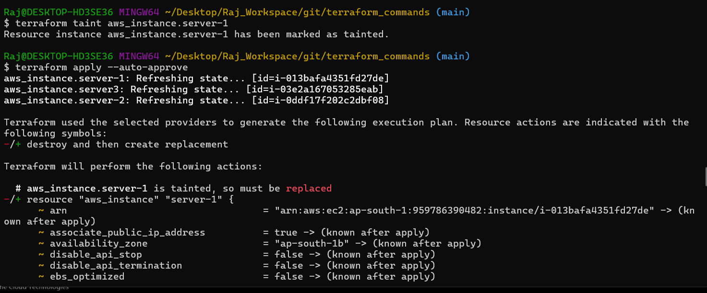
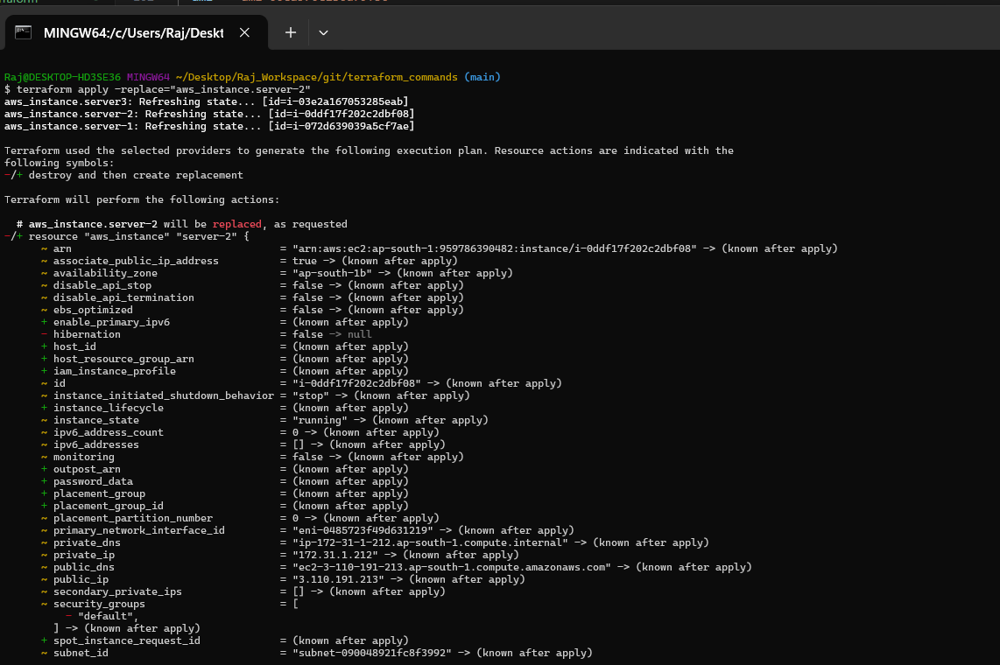
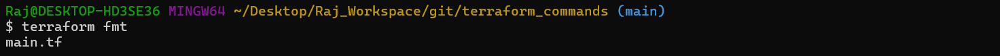

# Terraform EC2 Provisioner & Module Examples

*A complete guide with screenshots and practical Terraform usage.*

---


## **Table of Contents**

1. [Project Overview](#project-overview)
2. [Folder Structure](#folder-structure)
3. [Local Exec Provisioner](#local-exec-provisioner)
4. [File Provisioner](#file-provisioner)
5. [Remote Exec Provisioner (Nginx Setup)](#remote-exec-provisioner-nginx-setup)
6. [Terraform Module Usage](#terraform-module-usage)
7. [Terraform Taint & Replace](#terraform-taint--replace)
8. [Terraform Formatting (fmt)](#terraform-formatting-fmt)
9. [How to Run](#how-to-run)
10. [Important Notes](#important-notes)
11. [Conclusion](#conclusion)

---

# **1. Project Overview**

This Terraform project demonstrates:

* Local execution using **local-exec**
* Remote EC2 command execution using **remote-exec**
* File upload to EC2 using **file provisioner**
* A reusable **Terraform module** for EC2 creation
* Handling **taint**, **replace**, and **terraform fmt**
* Demonstrating provisioning by installing **Nginx**

This repository is ideal for beginners and intermediate users to understand practical Terraform automation.

---

# **2. Folder Structure**

```
terraform_commands/
│── main.tf
│── variables.tf
│── output.tf
│── modules/
│     ├── main.tf
│     ├── variables.tf
│     └── output.tf
│── img/
│── README.md
```

---

# **3. Local Exec Provisioner**

Runs locally on the machine where Terraform is executed.

### **Purpose:**

Store EC2 instance public IP inside a local file.

### Code

```hcl
provisioner "local-exec" {
  command = "echo ${self.public_ip} >> public_ip_address.txt"
}
```

### Screenshot



---

# **4. File Provisioner**

Uploads a local file to the EC2 instance at `/tmp`.

### Code

```hcl
provisioner "file" {
  source      = "public_ip_address.txt"
  destination = "/tmp/public_ip_address.txt"

  connection {
    type        = "ssh"
    host        = self.public_ip
    user        = "ec2-user"
    private_key = file("C:/Users/Raj/Downloads/com.pem")
  }
}
```

### Screenshots

**File transfer complete:**


**File visible on EC2:**


---

# **5. Remote Exec Provisioner (Nginx Setup)**

Runs commands remotely on EC2 to install and start Nginx.

### Code

```hcl
provisioner "remote-exec" {
  inline = [
    "sudo yum update -y",
    "sudo yum install nginx -y",
    "sudo systemctl start nginx",
    "sudo systemctl enable nginx"
  ]

  connection {
    type        = "ssh"
    user        = "ec2-user"
    host        = self.public_ip
    private_key = file("C:/Users/Raj/Downloads/com.pem")
  }
}
```

### Screenshots

**Provisioning output:**


**Nginx page:**


---

# **6. Terraform Module Usage**

Reusable EC2 module example.

### Root `main.tf`

```hcl
module "ec2_instance" {
  source = "./modules"
}
```

### Module Structure

```
modules/
│── main.tf
│── variables.tf
│── output.tf
```

### Screenshot



---

# **7. Terraform Taint & Replace**

### Older Taint Method

```bash
terraform taint aws_instance.server-1
terraform apply
```



### Modern Replace Method

```bash
terraform apply -replace="aws_instance.server-2"
```



---

# **8. Terraform Formatting (fmt)**

To clean and format all `.tf` files:

```bash
terraform fmt
```



---

# **9. How to Run**

### Initialize project

```bash
terraform init
```

### Validate & Format

```bash
terraform validate
terraform fmt
```

### Apply configuration

```bash
terraform apply --auto-approve
```

### Destroy resources

```bash
terraform destroy --auto-approve
```

---

# **10. Conclusion**

This repository serves as a complete, practical example of Terraform automation on AWS:

* Running commands locally and remotely
* Uploading files to EC2
* Installing services like Nginx
* Using modules effectively
* Managing lifecycle with taint/replace
* Producing clean, formatted Terraform code

